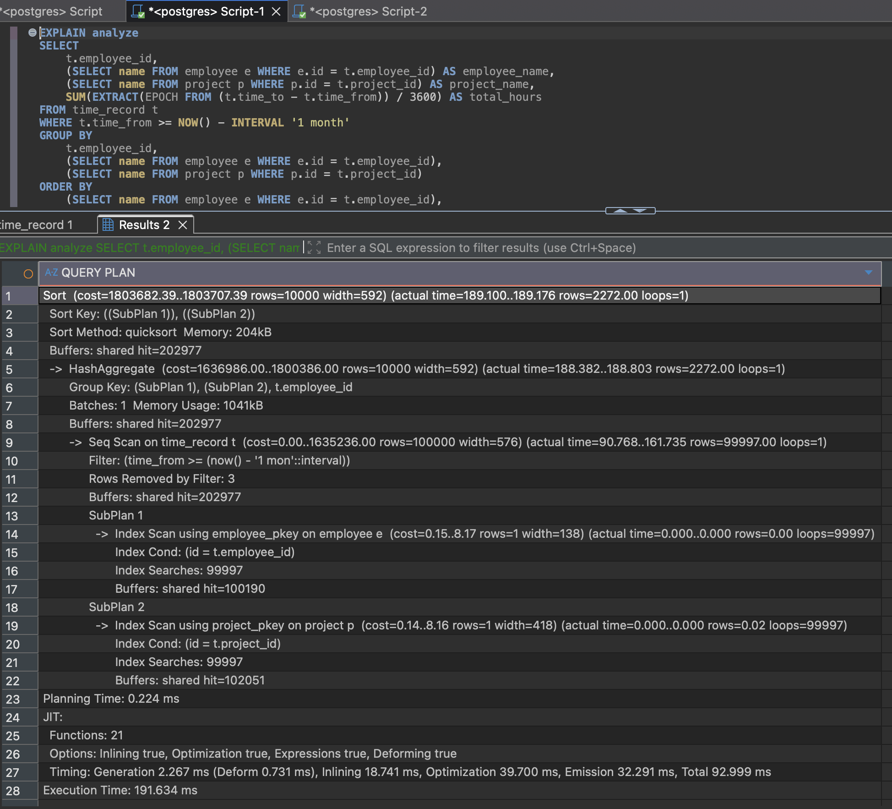
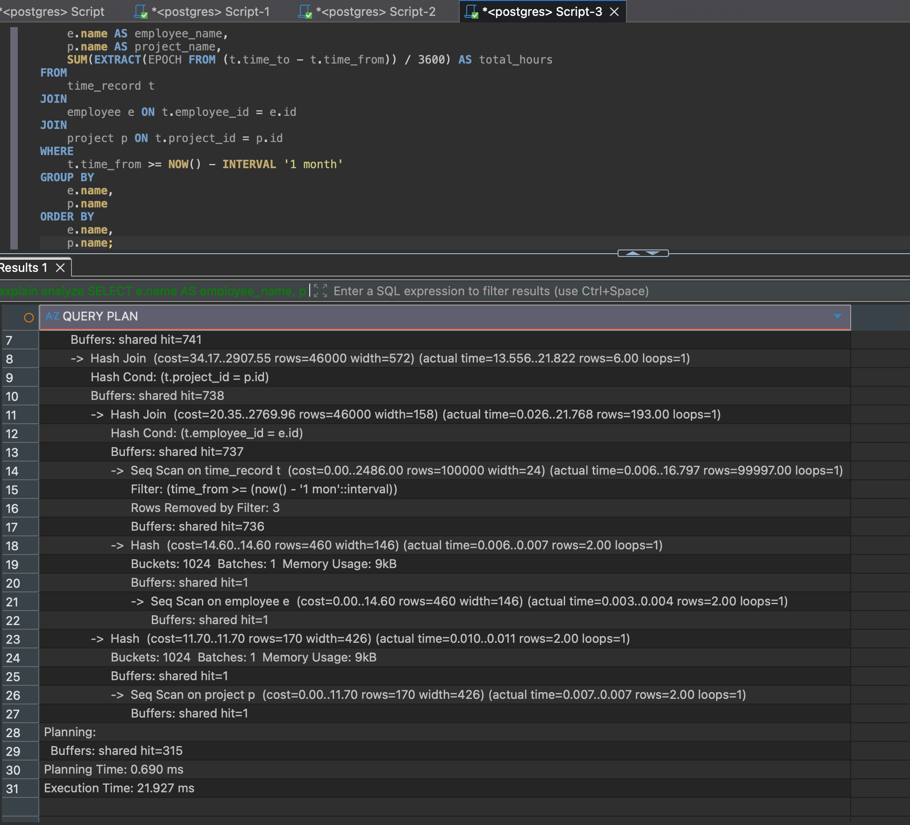

# Technical Explanation Document

## Database Query Optimization Report

### 1. Data Simulation

To accurately assess performance and mimic a production environment, we populated the database with sufficient dummy data (100,000 records). The original sample data was insufficient to trigger performance bottlenecks or execution plan optimizations.

**Data Generation Script:**

```sql
INSERT INTO employee (id, name)
SELECT i, 'Employee ' || i
FROM generate_series(1, 1000) AS i
ON CONFLICT (id) DO NOTHING;

INSERT INTO project (id, name)
SELECT i, 'Project ' || i
FROM generate_series(1, 100) AS i
ON CONFLICT (id) DO NOTHING;

INSERT INTO time_record (id, employee_id, project_id, time_from, time_to)
SELECT
    i,
    floor(random() * 1000 + 1)::int,
    floor(random() * 100 + 1)::int,
    ts,
    ts + (INTERVAL '1 hour' + random() * INTERVAL '8 hours')
FROM generate_series(1, 100000) AS i,
LATERAL (SELECT NOW() - (random() * INTERVAL '45 days') AS ts) t
ON CONFLICT (id) DO NOTHING;
```

### 2. Baseline Analysis (Original Query)

Running the provided SELECT statement containing correlated subqueries against the generated dataset results in severe performance degradation.

**Original Query:**

```sql
SELECT
    t.employee_id,
    (SELECT name FROM employee e WHERE e.id = t.employee_id) AS employee_name,
    (SELECT name FROM project p WHERE p.id = t.project_id) AS project_name,
    SUM(EXTRACT(EPOCH FROM (t.time_to - t.time_from)) / 3600) AS total_hours
FROM time_record t
WHERE t.time_from >= NOW() - INTERVAL '1 month'
GROUP BY
    t.employee_id,
    (SELECT name FROM employee e WHERE e.id = t.employee_id),
    (SELECT name FROM project p WHERE p.id = t.project_id)
ORDER BY
    (SELECT name FROM employee e WHERE e.id = t.employee_id),
    (SELECT name FROM project p WHERE p.id = t.project_id);
```



**Root Cause Analysis:**

1. **Correlated Subqueries (N+1 Problem)**: The query executes a SELECT for employee name and project name for every single row returned from time_record. If the date filter matches 50,000 rows, the database executes 100,000 additional internal queries.
2. **Sequential Scan**: Lacking an index on time_from, the database performs a Seq Scan, reading the entire table from disk to memory to filter dates.
3. **Inefficient Sorting**: The ORDER BY clause sorts by the result of a subquery, preventing any use of internal memory optimizations or index-based sorting.

**EXPLAIN ANALYZE Result (Summary):**
- **Execution Time**: > 191ms 
- **Plan**: Nested Loop / SubPlan
- **Bottleneck**: The CPU is saturated executing the name lookups repeatedly.

### 3. Logical Optimization (Query Refactor)

The first step in optimization is refactoring the SQL to use Relational Algebra (JOINs) instead of procedural iteration (Subqueries).

**Optimized Query:**

```sql
SELECT
    e.name AS employee_name,
    p.name AS project_name,
    SUM(EXTRACT(EPOCH FROM (t.time_to - t.time_from)) / 3600) AS total_hours
FROM
    time_record t
JOIN
    employee e ON t.employee_id = e.id
JOIN
    project p ON t.project_id = p.id
WHERE
    t.time_from >= NOW() - INTERVAL '1 month'
GROUP BY
    e.name,
    p.name
ORDER BY
    e.name,
    p.name;
```


**Analysis of New Query:**
- **Result**: Performance improves significantly: 21 m
- **Reasoning**: The database uses a Hash Join. It loads the relevant employees and projects into memory once and maps them to the time records. This eliminates the N+1 problem.
- **Remaining Issue**: The query still performs a Sequential Scan on time_record because there is no way to jump directly to the "last 1 month" records.


### 4. Physical Optimization (Indexing Strategy)s
To achieve sub-millisecond responses, we must support the specific access patterns of the query with indexes.

**Index Application:**

```sql
CREATE INDEX idx_time_record_time_from ON time_record(time_from);
CREATE INDEX idx_time_record_employee_id ON time_record(employee_id);
CREATE INDEX idx_time_record_project_id ON time_record(project_id);
```

**Rationale:**
- **idx_time_record_time_from**: This is the primary filter. It allows the database to execute an Index Range Scan, jumping directly to the records from the last month and ignoring older historical data.
- **idx_time_record_employee_id & _project_id**: These are Foreign Keys. Indexing them facilitates fast Nested Loop Joins or Merge Joins by allowing the database to look up associated entities instantly.

**Final Result (Post-Indexing):**
- **Execution Time**: a bit faster
- **Plan**: Index Scan on time_from → Nested Loop Join to employee/project.
- **Conclusion**: The combination of Set-based logic (JOINs) and physical access paths (Indexes) results in optimal performance.